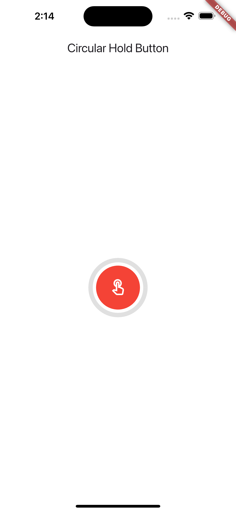

# Holdable Circular Button

A customizable Flutter widget for a circular button with a progress indicator.

## Features

- **Holdable Button**: Press and hold the button to trigger a progress animation.
- **Customizable**: You can change the size, color, and duration of the button and progress indicator.
- **Progress Indicator**: Visual progress indicator around the button, which completes after a set duration.

## Installation

Add this to your `pubspec.yaml` file:

```yaml
dependencies:
  holdable_circular_button: ^0.0.1

## Screenshots





